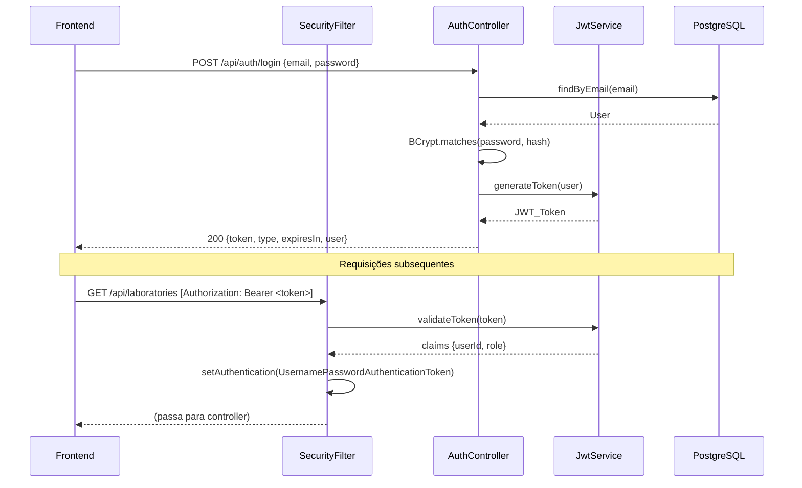
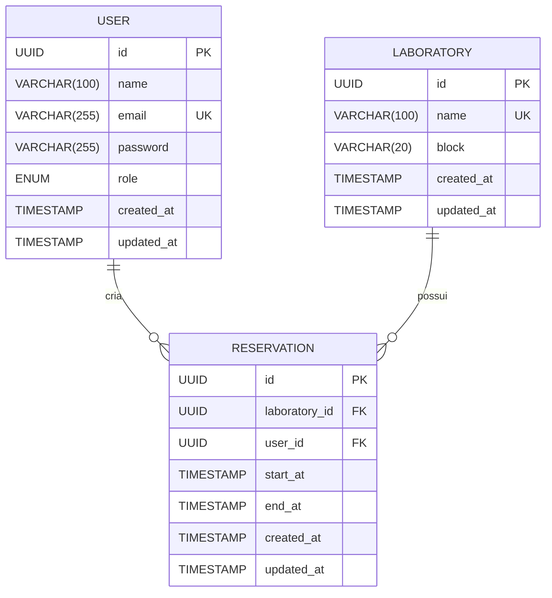

# Design Document — CampusLab

## Overview

O CampusLab é um sistema web para gerenciamento dos laboratórios de um campus universitário. A solução é composta por dois artefatos independentes:

- **Backend**: API REST em Java 21 + Spring Boot 3, responsável pela autenticação JWT, regras de negócio e persistência.
- **Frontend**: Single-Page Application em React + TypeScript + Tailwind CSS, responsável pela interface do usuário.

A autenticação é baseada em JWT (JSON Web Token) e sem estado (stateless). O controle de acesso é baseado em roles: `ALUNO` tem acesso somente leitura; `PROFESSOR` tem acesso completo de gerenciamento.

### Principais funcionalidades

| Funcionalidade | ALUNO | PROFESSOR |
|---|---|---|
| Login | ✅ | ✅ |
| Listar/consultar laboratórios | ✅ | ✅ |
| Criar/editar/excluir laboratórios | ❌ | ✅ |
| Listar/consultar reservas | ✅ | ✅ |
| Criar/editar/excluir reservas | ❌ | ✅ |

---

## Architecture

A arquitetura segue o padrão em camadas com separação clara de responsabilidades:

```
Frontend (React/TS)
      │
      │  HTTP/JSON (JWT Bearer)
      ▼
┌─────────────────────────────┐
│         API Gateway         │  (Spring Boot embedded Tomcat)
│    SecurityFilter (JWT)     │
├─────────────────────────────┤
│      Controller Layer       │  (REST endpoints)
├─────────────────────────────┤
│       Service Layer         │  (Business logic)
├─────────────────────────────┤
│      Repository Layer       │  (Spring Data JPA)
├─────────────────────────────┤
│         PostgreSQL          │
└─────────────────────────────┘
```

### Pacotes do Backend

```
com.campuslab
├── auth
│   ├── AuthController
│   ├── AuthService
│   └── dto/
│       ├── LoginRequest
│       └── LoginResponse
├── user
│   ├── User              (entity)
│   ├── UserRole          (enum: ALUNO, PROFESSOR)
│   └── UserRepository
├── laboratory
│   ├── Laboratory        (entity)
│   ├── LaboratoryController
│   ├── LaboratoryService
│   ├── LaboratoryRepository
│   └── dto/
│       ├── LaboratoryRequest
│       └── LaboratoryResponse
├── reservation
│   ├── Reservation       (entity)
│   ├── ReservationController
│   ├── ReservationService
│   ├── ReservationRepository
│   └── dto/
│       ├── ReservationRequest
│       └── ReservationResponse
└── shared
    ├── config
    │   ├── SecurityConfig
    │   └── JwtConfig
    ├── security
    │   ├── SecurityFilter   (OncePerRequestFilter)
    │   └── JwtService
    └── exception
        ├── ErrorHandler     (GlobalExceptionHandler)
        ├── ErrorResponse    (DTO padrão)
        └── exceptions/
            ├── ResourceNotFoundException
            ├── ReservationConflictException
            ├── LaboratoryHasFutureReservationsException
            └── DuplicateNameException
```

### Estrutura do Frontend

```
src/
├── api/
│   ├── axiosClient.ts      (interceptor JWT)
│   ├── authApi.ts
│   ├── laboratoryApi.ts
│   └── reservationApi.ts
├── components/
│   ├── ProtectedRoute.tsx
│   ├── RoleGuard.tsx
│   ├── LoadingSpinner.tsx
│   └── ErrorMessage.tsx
├── pages/
│   ├── LoginPage.tsx
│   ├── LaboratoryListPage.tsx
│   ├── LaboratoryDetailPage.tsx
│   └── NotFoundPage.tsx
├── hooks/
│   ├── useAuth.ts
│   └── useApi.ts
├── store/
│   └── authStore.ts        (Zustand ou Context API)
└── types/
    ├── auth.ts
    ├── laboratory.ts
    └── reservation.ts
```

### Diagrama de Fluxo de Autenticação



---

## Components and Interfaces

### Backend — Endpoints REST

#### Auth

| Método | Endpoint | Acesso | Descrição |
|--------|----------|--------|-----------|
| POST | `/api/auth/login` | Público | Autenticação, retorna JWT |

#### Laboratories

| Método | Endpoint | Acesso | Descrição |
|--------|----------|--------|-----------|
| GET | `/api/laboratories` | ALUNO, PROFESSOR | Lista todos os laboratórios |
| GET | `/api/laboratories/{id}` | ALUNO, PROFESSOR | Detalhes + reservas |
| POST | `/api/laboratories` | PROFESSOR | Cria laboratório |
| PUT | `/api/laboratories/{id}` | PROFESSOR | Atualiza laboratório |
| DELETE | `/api/laboratories/{id}` | PROFESSOR | Exclui laboratório |

#### Reservations

| Método | Endpoint | Acesso | Descrição |
|--------|----------|--------|-----------|
| GET | `/api/laboratories/{labId}/reservations` | ALUNO, PROFESSOR | Lista reservas do lab |
| GET | `/api/reservations/{id}` | ALUNO, PROFESSOR | Detalhes da reserva |
| POST | `/api/laboratories/{labId}/reservations` | PROFESSOR | Cria reserva |
| PUT | `/api/reservations/{id}` | PROFESSOR | Atualiza reserva |
| DELETE | `/api/reservations/{id}` | PROFESSOR | Exclui reserva |

### SecurityFilter (OncePerRequestFilter)

O filtro é registrado antes do `UsernamePasswordAuthenticationFilter` na cadeia do Spring Security. Ele:

1. Extrai o header `Authorization: Bearer <token>`
2. Valida estrutura, assinatura e expiração do JWT via `JwtService`
3. Em caso de token válido, cria um `UsernamePasswordAuthenticationToken` com as authorities derivadas da role e chama `SecurityContextHolder.getContext().setAuthentication(...)`
4. Em caso de falha, não lança exceção — a requisição prossegue sem autenticação e o Spring Security retorna 401/403 conforme a configuração de `authorizeHttpRequests`

```java
// Configuração do SecurityConfig
http
  .csrf(AbstractHttpConfigurer::disable)
  .sessionManagement(s -> s.sessionCreationPolicy(SessionCreationPolicy.STATELESS))
  .authorizeHttpRequests(auth -> auth
    .requestMatchers(POST, "/api/auth/login").permitAll()
    .requestMatchers(GET, "/api/laboratories/**").hasAnyRole("ALUNO", "PROFESSOR")
    .requestMatchers(GET, "/api/reservations/**").hasAnyRole("ALUNO", "PROFESSOR")
    .requestMatchers("/api/laboratories/**", "/api/reservations/**").hasRole("PROFESSOR")
    .anyRequest().authenticated()
  )
  .addFilterBefore(securityFilter, UsernamePasswordAuthenticationFilter.class);
```

### JwtService

Responsável pela geração e validação de tokens. Utiliza a biblioteca **JJWT** (`io.jsonwebtoken`).

```java
// Geração
String generateToken(User user);

// Validação — retorna claims ou lança JwtException
Claims validateToken(String token);

// Extração de informações
String extractUserId(String token);
String extractRole(String token);
```

O payload do JWT contém:
- `sub`: UUID do usuário
- `role`: `ALUNO` ou `PROFESSOR`
- `iat`: emitido em
- `exp`: expiração (`now + expiresIn`)

### AuthService

```java
LoginResponse login(LoginRequest request);
```

- Busca o usuário por email com `UserRepository.findByEmail`
- Verifica a senha com `BCryptPasswordEncoder.matches`
- Gera o JWT com `JwtService.generateToken`
- Retorna `LoginResponse { token, type="Bearer", expiresIn, user }`

### LaboratoryService

```java
List<LaboratoryResponse> findAll();
LaboratoryResponse findById(UUID id);
LaboratoryResponse create(LaboratoryRequest request);
LaboratoryResponse update(UUID id, LaboratoryRequest request);
void delete(UUID id);
```

Regras:
- `findAll()`: calcula `reserved = repository.existsFutureReservationByLaboratoryId(id, now)`
- `delete()`: verifica se existe alguma `Reservation` com `startAt > now`; se sim, lança `LaboratoryHasFutureReservationsException` (HTTP 409, code `LABORATORY_HAS_FUTURE_RESERVATIONS`)
- `create()` / `update()`: verifica unicidade do `name`; se duplicado, lança `DuplicateNameException` (HTTP 409)

### ReservationService

```java
List<ReservationResponse> findByLaboratory(UUID laboratoryId);
ReservationResponse findById(UUID id);
ReservationResponse create(UUID laboratoryId, ReservationRequest request);
ReservationResponse update(UUID id, ReservationRequest request);
void delete(UUID id);
```

Regras (detalhadas na seção de Error Handling):
1. `startAt < endAt` — rejeita com HTTP 400
2. `endAt - startAt >= 1 minuto` — rejeita com HTTP 400
3. Sem `ReservationConflict` com reservas ativas no mesmo laboratório — rejeita com HTTP 409
4. Na atualização, exclui a própria reserva da verificação de conflito

### Frontend — Componentes Principais

**`ProtectedRoute`**: Redireciona para `/login` se não houver JWT válido no estado de autenticação.

**`RoleGuard`**: Renderiza filhos apenas se o usuário tiver a role exigida (`requiredRole` prop). Ocultação baseada no role do token decodificado.

**`axiosClient`**: Instância do Axios com interceptor que injeta o header `Authorization: Bearer <token>` em todas as requisições. Trata resposta 401 redirecionando para `/login` (token expirado/inválido).

**Roteamento (React Router)**:
```
/login                  → LoginPage (público)
/laboratories           → LaboratoryListPage (protegido)
/laboratories/:id       → LaboratoryDetailPage (protegido)
*                       → NotFoundPage
```

---

## Data Models

### Diagrama Entidade-Relacionamento



### Entidade `User`

```java
@Entity
@Table(name = "users")
public class User {
    @Id @GeneratedValue(strategy = GenerationType.UUID)
    private UUID id;

    @Column(nullable = false, length = 100)
    private String name;

    @Column(nullable = false, unique = true, length = 255)
    private String email;

    @Column(nullable = false, length = 255)
    private String password; // BCrypt hash

    @Enumerated(EnumType.STRING)
    @Column(nullable = false)
    private UserRole role; // ALUNO | PROFESSOR

    @CreationTimestamp
    private Instant createdAt;

    @UpdateTimestamp
    private Instant updatedAt;
}
```

### Entidade `Laboratory`

```java
@Entity
@Table(name = "laboratories")
public class Laboratory {
    @Id @GeneratedValue(strategy = GenerationType.UUID)
    private UUID id;

    @Column(nullable = false, unique = true, length = 100)
    private String name;

    @Column(nullable = false, length = 20)
    private String block;

    @OneToMany(mappedBy = "laboratory", cascade = CascadeType.ALL, orphanRemoval = true)
    private List<Reservation> reservations = new ArrayList<>();

    @CreationTimestamp
    private Instant createdAt;

    @UpdateTimestamp
    private Instant updatedAt;
}
```

### Entidade `Reservation`

```java
@Entity
@Table(name = "reservations")
public class Reservation {
    @Id @GeneratedValue(strategy = GenerationType.UUID)
    private UUID id;

    @ManyToOne(fetch = FetchType.LAZY)
    @JoinColumn(name = "laboratory_id", nullable = false)
    private Laboratory laboratory;

    @ManyToOne(fetch = FetchType.LAZY)
    @JoinColumn(name = "user_id", nullable = false)
    private User user;

    @Column(nullable = false)
    private Instant startAt;

    @Column(nullable = false)
    private Instant endAt;

    @CreationTimestamp
    private Instant createdAt;

    @UpdateTimestamp
    private Instant updatedAt;
}
```

### DTOs de Resposta

**`LaboratoryResponse`**:
```json
{
  "id": "uuid",
  "name": "Laboratório A",
  "block": "Bloco B",
  "reserved": true,
  "createdAt": "2025-01-01T10:00:00Z",
  "updatedAt": "2025-01-01T10:00:00Z"
}
```

**`LaboratoryDetailResponse`** (inclui reservas):
```json
{
  "id": "uuid",
  "name": "Laboratório A",
  "block": "Bloco B",
  "reserved": true,
  "reservations": [ /* lista de ReservationResponse */ ],
  "createdAt": "2025-01-01T10:00:00Z",
  "updatedAt": "2025-01-01T10:00:00Z"
}
```

**`ReservationResponse`**:
```json
{
  "id": "uuid",
  "laboratoryId": "uuid",
  "userId": "uuid",
  "startAt": "2025-06-01T14:00:00Z",
  "endAt": "2025-06-01T16:00:00Z",
  "createdAt": "2025-01-01T10:00:00Z"
}
```

**`ErrorResponse`** (formato padronizado):
```json
{
  "timestamp": "2025-01-01T10:00:00Z",
  "status": 409,
  "code": "RESERVATION_CONFLICT",
  "message": "Existe conflito de horário com outra reserva ativa no mesmo laboratório.",
  "path": "/api/laboratories/uuid/reservations"
}
```

### Schema SQL (PostgreSQL)

```sql
CREATE TABLE users (
    id          UUID PRIMARY KEY DEFAULT gen_random_uuid(),
    name        VARCHAR(100) NOT NULL,
    email       VARCHAR(255) NOT NULL UNIQUE,
    password    VARCHAR(255) NOT NULL,
    role        VARCHAR(20)  NOT NULL CHECK (role IN ('ALUNO', 'PROFESSOR')),
    created_at  TIMESTAMP WITH TIME ZONE DEFAULT NOW(),
    updated_at  TIMESTAMP WITH TIME ZONE DEFAULT NOW()
);

CREATE TABLE laboratories (
    id          UUID PRIMARY KEY DEFAULT gen_random_uuid(),
    name        VARCHAR(100) NOT NULL UNIQUE,
    block       VARCHAR(20)  NOT NULL,
    created_at  TIMESTAMP WITH TIME ZONE DEFAULT NOW(),
    updated_at  TIMESTAMP WITH TIME ZONE DEFAULT NOW()
);

CREATE TABLE reservations (
    id             UUID PRIMARY KEY DEFAULT gen_random_uuid(),
    laboratory_id  UUID NOT NULL REFERENCES laboratories(id),
    user_id        UUID NOT NULL REFERENCES users(id),
    start_at       TIMESTAMP WITH TIME ZONE NOT NULL,
    end_at         TIMESTAMP WITH TIME ZONE NOT NULL,
    created_at     TIMESTAMP WITH TIME ZONE DEFAULT NOW(),
    updated_at     TIMESTAMP WITH TIME ZONE DEFAULT NOW(),
    CONSTRAINT chk_reservation_order CHECK (end_at > start_at)
);

-- Índice para consultas de conflito de horário
CREATE INDEX idx_reservations_lab_time
    ON reservations(laboratory_id, start_at, end_at);
```

### Repositórios (Consultas customizadas)

```java
// ReservationRepository
@Query("""
    SELECT COUNT(r) > 0
    FROM Reservation r
    WHERE r.laboratory.id = :labId
      AND r.id <> :excludeId
      AND r.endAt > :now
      AND r.startAt < :endAt
      AND r.endAt > :startAt
    """)
boolean existsConflict(
    @Param("labId") UUID labId,
    @Param("excludeId") UUID excludeId,
    @Param("startAt") Instant startAt,
    @Param("endAt") Instant endAt,
    @Param("now") Instant now
);

@Query("""
    SELECT COUNT(r) > 0
    FROM Reservation r
    WHERE r.laboratory.id = :labId
      AND r.startAt > :now
    """)
boolean existsFutureReservation(
    @Param("labId") UUID labId,
    @Param("now") Instant now
);

List<Reservation> findByLaboratoryIdOrderByStartAtAsc(UUID laboratoryId);
```


---

## Correctness Properties

*Uma propriedade é uma característica ou comportamento que deve ser verdadeiro em todas as execuções válidas de um sistema — essencialmente, uma declaração formal sobre o que o sistema deve fazer. As propriedades servem como ponte entre especificações legíveis por humanos e garantias de correção verificáveis por máquinas.*

### Property 1: BCrypt hash é verificável para qualquer senha

*Para qualquer* string de senha não nula, o hash BCrypt gerado pelo `AuthService` deve ser verificável com `BCryptPasswordEncoder.matches(senha, hash)` e não deve ser igual à senha em texto claro.

**Validates: Requirements 1.4**

---

### Property 2: JWT gerado contém userId e role corretos

*Para qualquer* usuário válido (com qualquer role), o JWT gerado pelo `JwtService` deve conter o `userId` correto no campo `sub` e a `role` correta no campo `role`, e deve ter `exp` igual a `iat + expiresIn`.

**Validates: Requirements 1.5**

---

### Property 3: Tokens inválidos sempre retornam 401

*Para qualquer* string que não seja um JWT válido assinado com a chave secreta configurada (token expirado, assinatura errada, estrutura malformada ou string aleatória), o `SecurityFilter` deve retornar HTTP 401 para qualquer endpoint protegido.

**Validates: Requirements 2.3**

---

### Property 4: Campo `reserved` reflete corretamente as FutureReservations

*Para qualquer* laboratório com qualquer conjunto de reservas (com `startAt` no passado e no futuro), o campo `reserved` retornado pelo `LaboratoryService` deve ser `true` se e somente se existir ao menos uma reserva cujo `startAt` seja estritamente posterior ao instante atual no momento da consulta.

**Validates: Requirements 3.4**

---

### Property 5: Exclusão de laboratório com reservas futuras sempre é rejeitada

*Para qualquer* laboratório que possua ao menos uma reserva com `startAt` estritamente posterior ao instante atual da requisição, a operação `DELETE /api/laboratories/{id}` deve sempre retornar HTTP 409 com código `LABORATORY_HAS_FUTURE_RESERVATIONS`, independentemente do número total de reservas ou de reservas passadas existentes.

**Validates: Requirements 4.4**

---

### Property 6: Lista de reservas sempre está ordenada por `startAt` crescente

*Para qualquer* laboratório com qualquer número de reservas em qualquer ordem de inserção, a resposta de `GET /api/laboratories/{laboratoryId}/reservations` deve retornar as reservas com `startAt[i] <= startAt[i+1]` para todo par consecutivo de elementos.

**Validates: Requirements 5.1**

---

### Property 7: Intervalos inválidos (startAt >= endAt ou duração < 1 min) são sempre rejeitados

*Para qualquer* par `(startAt, endAt)` onde `startAt >= endAt` ou onde `endAt - startAt < 60 segundos` (mas `endAt > startAt`), as operações `POST` e `PUT` de reserva devem sempre retornar HTTP 400, sem persistir nenhuma reserva.

**Validates: Requirements 7.1, 7.6**

---

### Property 8: Intervalos sobrepostos são sempre rejeitados (invariante de não-conflito)

*Para quaisquer* dois intervalos `[startA, endA]` e `[startB, endB]` onde ambos possuem `endAt` estritamente posterior ao instante atual e onde a condição `NOT (endA <= startB OR endB <= startA)` seja verdadeira (sobreposição), a tentativa de criar ou atualizar uma reserva com o segundo intervalo no mesmo laboratório onde o primeiro já existe deve sempre retornar HTTP 409, sem modificar nenhum dado existente. Consequentemente, após toda operação bem-sucedida, *para todo* par de reservas ativas `A` e `B` no mesmo laboratório com `A.id != B.id`, deve valer `A.endAt <= B.startAt` ou `B.endAt <= A.startAt`.

**Validates: Requirements 7.2, 7.5**

---

### Property 9: Atualização de reserva não conflita consigo mesma

*Para qualquer* reserva existente `R` com intervalo `[startAt, endAt]` válido, a operação de atualização `PUT /api/reservations/{R.id}` com os mesmos valores de `startAt` e `endAt` (ou com um novo intervalo válido que não conflite com outras reservas) deve sempre retornar HTTP 200, nunca rejeitar com HTTP 409 por conflito consigo mesma.

**Validates: Requirements 7.3**

---

### Property 10: Todas as respostas de erro seguem o formato padronizado

*Para qualquer* operação que resulte em erro HTTP (400, 401, 403, 404, 409 ou 500), a resposta deve conter exatamente os campos `timestamp` (string ISO 8601 UTC), `status` (inteiro igual ao código HTTP), `code` (string não vazia, distinta do status), `message` (string com no máximo 512 caracteres) e `path` (string correspondente ao endpoint chamado).

**Validates: Requirements 8.1, 8.3**

---

### Property 11: Controle de visibilidade de ações por role (Frontend)

*Para qualquer* usuário autenticado com role `ALUNO`, os botões e controles de criação, edição e exclusão de laboratórios e reservas nunca devem estar presentes no DOM renderizado. *Para qualquer* usuário com role `PROFESSOR`, esses controles devem estar presentes e acessíveis.

**Validates: Requirements 10.2, 10.3, 12.1**

---

### Property 12: Formulários com entrada inválida nunca disparam requisições à API

*Para qualquer* combinação de campos de formulário que viole as restrições de validação (campos obrigatórios vazios, limites de caracteres excedidos, `startAt >= endAt`, `startAt` ausente, `endAt` ausente, formato de data inválido), o formulário deve exibir mensagens de validação sem enviar nenhuma requisição HTTP à API.

**Validates: Requirements 11.1, 12.2**

---

## Error Handling

### Estratégia Global de Tratamento de Erros

O `ErrorHandler` é implementado como um `@RestControllerAdvice` com `@ExceptionHandler` para cada tipo de exceção. Todas as respostas de erro usam o DTO `ErrorResponse`.

```java
@RestControllerAdvice
public class ErrorHandler {

    @ExceptionHandler(ResourceNotFoundException.class)
    @ResponseStatus(HttpStatus.NOT_FOUND)
    public ErrorResponse handleNotFound(ResourceNotFoundException ex, HttpServletRequest req) { ... }

    @ExceptionHandler(ReservationConflictException.class)
    @ResponseStatus(HttpStatus.CONFLICT)
    public ErrorResponse handleConflict(ReservationConflictException ex, HttpServletRequest req) { ... }

    @ExceptionHandler(MethodArgumentNotValidException.class)
    @ResponseStatus(HttpStatus.BAD_REQUEST)
    public ErrorResponse handleValidation(MethodArgumentNotValidException ex, HttpServletRequest req) { ... }

    @ExceptionHandler(Exception.class)
    @ResponseStatus(HttpStatus.INTERNAL_SERVER_ERROR)
    public ErrorResponse handleGeneric(Exception ex, HttpServletRequest req) { ... }
    // NUNCA expõe stack trace, nome de classe interna ou detalhes de query
}
```

### Mapeamento de Exceções para Códigos HTTP

| Exceção | HTTP Status | Code |
|---------|-------------|------|
| `ResourceNotFoundException` | 404 | `RESOURCE_NOT_FOUND` |
| `ReservationConflictException` | 409 | `RESERVATION_CONFLICT` |
| `LaboratoryHasFutureReservationsException` | 409 | `LABORATORY_HAS_FUTURE_RESERVATIONS` |
| `DuplicateNameException` | 409 | `DUPLICATE_LABORATORY_NAME` |
| `InvalidReservationPeriodException` | 400 | `INVALID_RESERVATION_PERIOD` |
| `MethodArgumentNotValidException` | 400 | `VALIDATION_ERROR` |
| `HttpMessageNotReadableException` | 400 | `MALFORMED_REQUEST` |
| `AccessDeniedException` (Spring Security) | 403 | `INSUFFICIENT_PERMISSIONS` |
| `AuthenticationException` (Spring Security) | 401 | `AUTHENTICATION_REQUIRED` |
| `DataAccessException` | 503 | `SERVICE_UNAVAILABLE` |
| `Exception` (genérica) | 500 | `INTERNAL_ERROR` |

### Validação de Reservas no Service

```java
// ReservationService — lógica de validação (sem acesso ao banco)
private void validatePeriod(Instant startAt, Instant endAt) {
    if (!startAt.isBefore(endAt)) {
        throw new InvalidReservationPeriodException("startAt deve ser anterior a endAt");
    }
    Duration duration = Duration.between(startAt, endAt);
    if (duration.toSeconds() < 60) {
        throw new InvalidReservationPeriodException("Duração mínima de 1 minuto não atingida");
    }
}

private void checkConflict(UUID laboratoryId, UUID excludeId, Instant startAt, Instant endAt) {
    if (reservationRepository.existsConflict(laboratoryId, excludeId, startAt, endAt, Instant.now())) {
        throw new ReservationConflictException("Conflito com reserva existente no laboratório");
    }
}
```

### Tratamento de Erros no Frontend

O `axiosClient` inclui um interceptor de resposta que trata os casos globais:

```typescript
axiosClient.interceptors.response.use(
  (response) => response,
  (error) => {
    if (error.response?.status === 401) {
      // Token expirado ou inválido — limpa storage e redireciona
      authStore.clearAuth();
      router.navigate('/login');
    }
    // Outros erros são propagados para tratamento local nos componentes
    return Promise.reject(error);
  }
);
```

---

## Testing Strategy

### Abordagem Dual

O projeto adota uma abordagem de testes complementar:

- **Testes de unidade (JUnit 5 + Mockito)**: Verificam comportamentos específicos, edge cases e integrações entre camadas mockadas.
- **Testes baseados em propriedades (jqwik)**: Verificam propriedades universais que devem valer para todos os inputs válidos e inválidos, com mínimo de 100 iterações por propriedade.
- **Testes de integração (Spring Boot Test + Testcontainers)**: Verificam o comportamento end-to-end com banco de dados real.
- **Testes de componente Frontend (Vitest + React Testing Library)**: Verificam renderização e comportamento dos componentes React.

### Backend — Property-Based Testing com jqwik

A biblioteca escolhida é **[jqwik](https://jqwik.net/)** (`net.jqwik:jqwik:1.8.x`), integrada ao JUnit 5 Platform. Para integração com Spring, usa-se `net.jqwik:jqwik-spring`.

```xml
<!-- pom.xml -->
<dependency>
    <groupId>net.jqwik</groupId>
    <artifactId>jqwik</artifactId>
    <version>1.8.5</version>
    <scope>test</scope>
</dependency>
<dependency>
    <groupId>net.jqwik</groupId>
    <artifactId>jqwik-spring</artifactId>
    <version>0.14.0</version>
    <scope>test</scope>
</dependency>
```

Cada property test implementa **uma única propriedade** do design, com tag de rastreabilidade:

```java
// Tag format: Feature: campus-lab, Property <N>: <property_text>

@Property(tries = 100)
// Feature: campus-lab, Property 1: BCrypt hash é verificável para qualquer senha
void bcryptHashIsAlwaysVerifiable(@ForAll @NotBlank String password) {
    String hash = authService.encodePassword(password);
    assertThat(passwordEncoder.matches(password, hash)).isTrue();
    assertThat(hash).isNotEqualTo(password);
}

@Property(tries = 200)
// Feature: campus-lab, Property 8: Intervalos sobrepostos são sempre rejeitados
void overlappingReservationsAreAlwaysRejected(
        @ForAll("overlappingIntervals") Pair<Interval, Interval> intervals) {
    // Cria reserva A com intervals.first()
    // Tenta criar reserva B com intervals.second() no mesmo laboratório
    // Verifica que retorna HTTP 409
}

@Property(tries = 200)
// Feature: campus-lab, Property 7: Intervalos inválidos são sempre rejeitados com 400
void invalidPeriodsAreAlwaysRejected(@ForAll("invalidPeriods") Pair<Instant, Instant> period) {
    assertThatThrownBy(() -> reservationService.validatePeriod(period.first(), period.second()))
        .isInstanceOf(InvalidReservationPeriodException.class);
}
```

### Frontend — Testes de Componente com Vitest + React Testing Library

```typescript
// Feature: campus-lab, Property 11: ALUNO nunca vê botões de ação
it.prop([fc.record({ role: fc.constant('ALUNO') })])
  ('ALUNO user never sees action buttons', (user) => {
    render(<LaboratoryListPage />, { wrapper: authContext(user) });
    expect(screen.queryByText(/Criar Laboratório/i)).not.toBeInTheDocument();
    expect(screen.queryByText(/Editar/i)).not.toBeInTheDocument();
    expect(screen.queryByText(/Excluir/i)).not.toBeInTheDocument();
  });
```

A biblioteca para PBT no frontend é **[fast-check](https://fast-check.dev/)** (`fast-check@3.x`), integrada ao Vitest via `@fast-check/vitest`.

### Estrutura dos Testes Backend

```
src/test/java/com/campuslab/
├── auth/
│   ├── AuthServiceTest.java          (unit)
│   ├── AuthServicePropertyTest.java  (PBT - Properties 1, 2)
│   └── AuthControllerIntegrationTest.java
├── security/
│   ├── SecurityFilterTest.java       (unit)
│   └── SecurityFilterPropertyTest.java (PBT - Property 3)
├── laboratory/
│   ├── LaboratoryServiceTest.java    (unit)
│   ├── LaboratoryServicePropertyTest.java (PBT - Properties 4, 5)
│   └── LaboratoryControllerIntegrationTest.java
├── reservation/
│   ├── ReservationServiceTest.java   (unit)
│   ├── ReservationServicePropertyTest.java (PBT - Properties 6, 7, 8, 9)
│   └── ReservationControllerIntegrationTest.java
└── shared/
    └── ErrorHandlerPropertyTest.java (PBT - Property 10)
```

### Cobertura Mínima Esperada

| Camada | Estratégia | Meta |
|--------|-----------|------|
| `AuthService` | Unit + PBT | ≥ 90% |
| `JwtService` | Unit + PBT | ≥ 90% |
| `LaboratoryService` | Unit + PBT | ≥ 90% |
| `ReservationService` | Unit + PBT | ≥ 95% (regras críticas) |
| `ErrorHandler` | Unit + PBT | ≥ 85% |
| Controllers | Integration | ≥ 80% |
| Frontend Components | RTL + fast-check | ≥ 80% |

### Configuração de Testes de Integração

Usa **Testcontainers** para subir uma instância PostgreSQL real nos testes de integração:

```java
@SpringBootTest(webEnvironment = SpringBootTest.WebEnvironment.RANDOM_PORT)
@Testcontainers
class ReservationControllerIntegrationTest {

    @Container
    static PostgreSQLContainer<?> postgres = new PostgreSQLContainer<>("postgres:16-alpine");

    @DynamicPropertySource
    static void configureProperties(DynamicPropertyRegistry registry) {
        registry.add("spring.datasource.url", postgres::getJdbcUrl);
        registry.add("spring.datasource.username", postgres::getUsername);
        registry.add("spring.datasource.password", postgres::getPassword);
    }
}
```
